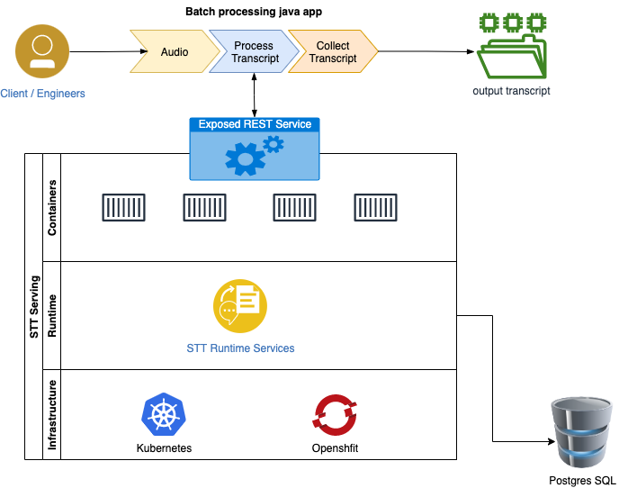

## STT Client Application
In this tutorial you will build and run a Java Spring Boot web application that relies on Watson Speech-to-Text (STT) as a back-end service. The application code can be used as a starting point when developing your own speech application.

The application demonstrates two interfaces that a client program can use to leverage Watson STT.
- **REST interface.** This is used for batch processing, where the client sends audio files to the Watson STT and recieves transcriptions synchronously.
- **WebSocket interface.** This can be used for streaming use cases, where the the communication happens asynchronously.

In order to use this tutorial, you need to have first deployed an instance of Watson STT on a Kubernetes or OpenShift cluster.

### Architecture diagram


 
### Prerequisites
- Docker is installed on your local machine.
- Java 17 is installed.
- Eclipse (optional) is installed, if you want to customize the application.
- You have deployed Watson STT on a Kubernetes or OpenShift cluster.

### Get the sample code
Clone the following GitHub repository.
```
git clone https://github.com/ibm-build-labs/Watson-NLP
```
This repository contains code that is used in this tutorial.

## Run on your local machine
Follow the steps below to run the application front-end on your local machine, 

### 1. Build
Go to the directory that contains sample code for this tutorial.
```
cd Watson-NLP/STTApplication
```
Run the command below to build and package the application.
```
./mvnw clean package
```
The application will be packaged in JAR file `target/STTApplication-0.0.1-SNAPSHOT.jar`.

### 2. Run
Login Kubernetes cluster and expose the STT service endpoint.
```
kubectl port-forward svc/install-1-stt-runtime 1080
```
Set the following environment variable. The Java application will use this to find the STT service.
```
export STT_SERVICE_ENDPOINT=127.0.0.1:1080
```
Run the application.
```
java -jar target/STTApplication-0.0.1-SNAPSHOT.jar
```
The application will listen on port 8080. 

### 3. Test
Access the application in your browser using the following URL.
```
http://localhost:8080
```

## Run on Kubernetes or OpenShift
Follow the steps below to run the application front-end on the Kubernetes or OpenShift cluster in which the back-end Watson STT service is running.

### 1. Build 
Go to the directory that contains sample code for this tutorial.
```
cd Watson-NLP/STTApplication
```
Run the command below to build and package the application.
```
./mvnw clean package
```
The application will be packaged in JAR file `target/STTApplication-0.0.1-SNAPSHOT.jar`.  

Containerize this, using the Dockerfile in the current directory. Build the image with the below command, but in the `-t` option replace the registry name with the registry that you will use to store the image.
```
docker build . -t us.icr.io/watson-core-demo/stt-web-application:v1
```
Push the image to the registry, replacing the registry name in the following command. 
```
docker push us.icr.io/watson-core-demo/stt-web-application:v1
```

### 2. Run
The Kubernetes manifest is in the `deployment` subdirectory.  There are two Kubernetes resources: a Deployment and a Service. Below is Deployment manifest, from `deployment/deployment.yaml`.
```
apiVersion: apps/v1
kind: Deployment
metadata:
  name: stt-web-app
spec:
  selector:
    matchLabels:
      app: stt-web-app
  replicas: 1
  template:
    metadata:
      labels:
        app: stt-web-app
    spec:
      containers:
      - name: stt-web-app
        image: us.icr.io/watson-core-demo/stt-web-application:v1
        resources:
          requests:
            memory: "500m"
            cpu: "100m"
          limits:
            memory: "1Gi"
            cpu: "500m"
        env:
          - name: STT_SERVICE_ENDPOINT
            value: "install-1-stt-runtime:1080"
        ports:
        - containerPort: 8080
```
Before you can use this you will need to modify the following:
 - **Image.** This should point to image in the registry that you pushed to earlier.
 - **STT_SERVICE_ENDPOINT.** This should be set to include the name and port of the Watson STT service running your Kubernetes or OpenShift cluster.
You can check the service endpoint with the following command.
```
kubectl get svc 
```
Output
```
NAME                          TYPE        CLUSTER-IP       EXTERNAL-IP   PORT(S)                         AGE
install-1-stt-runtime         NodePort    172.21.206.51    <none>        1080:30280/TCP,1443:32753/TCP   14d
install-1-tts-runtime         NodePort    172.21.199.140   <none>        1080:31439/TCP,1443:30824/TCP   14d
```

Create the kubernetes resource.
```
kubectl apply -f /deployment/
```
Check that the Pod and Service are running.
```
kubectl get pods
```
```
NAME                                           READY   STATUS    RESTARTS   AGE
stt-web-app-64d9df8f49-4fm97                   1/1     Running   0          25h
```
```
kubectl get svc 
```
```
NAME                          TYPE        CLUSTER-IP       EXTERNAL-IP   PORT(S)                         AGE
stt-web-app                   ClusterIP   172.21.238.164   <none>        8080/TCP                        25h
```

### 3. Test 
To access the app, you need to do a port-forward
```
kubectl port-forward svc/stt-web-app 8080
```

you can access the app at http://localhost:8080

## Understanding the Application Code

The Feign library is used to make REST calls. Below is the list of libraries that are used for this application.
```
<dependencies>
		<dependency>
			<groupId>org.springframework.boot</groupId>
			<artifactId>spring-boot-starter-thymeleaf</artifactId>
		</dependency>
		<dependency>
			<groupId>org.springframework.boot</groupId>
			<artifactId>spring-boot-starter-web</artifactId>
		</dependency>
		<dependency>
			<groupId>org.springframework.cloud</groupId>
			<artifactId>spring-cloud-starter-openfeign</artifactId>
		</dependency>
		<dependency>
		  <groupId>io.github.openfeign</groupId>
		  <artifactId>feign-httpclient</artifactId>
		</dependency>
</dependencies>
```

