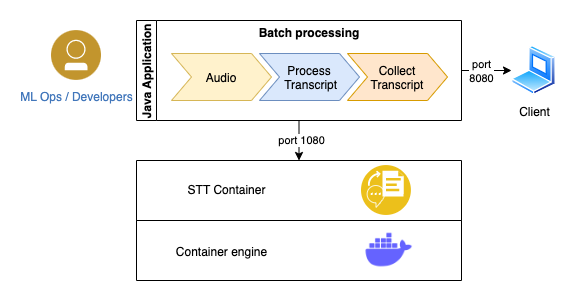

## STT Client Application
In this tutorial you will build and run a Java Spring Boot web application that relies on Watson Speech-to-Text (STT) as a back-end service. The application code can be used as a starting point when developing your own speech application.

The application demonstrates two interfaces that a client program can use to leverage Watson STT.
- **REST interface.** This is used for batch processing, where the client sends audio files to the Watson STT and recieves transcriptions synchronously.
- **WebSocket interface.** This can be used for streaming use cases, where the the communication happens asynchronously.

In order to use this tutorial, you need to Run a Single-Container Speech-to-Text Service on Docker in your workstation. Please follow this [tutorial](https://github.com/ibm-build-lab/Watson-Speech/tree/main/single-container-stt) to run the STT service.

### Architecture diagram


 
### Prerequisites
- [Docker](https://docs.docker.com/get-docker/) is installed
- [Java 17 JDK](https://www.oracle.com/java/technologies/downloads/#java17) is installed
- You an STT Service running in a Docker container, as described [here](https://github.com/ibm-build-lab/Watson-Speech/tree/main/single-container-stt)

### Get the sample code
Clone the following GitHub repository.
```
git clone https://github.com/ibm-build-labs/Watson-Speech
```
This repository contains code that is used in this tutorial.

## Steps
Follow the steps below to run the application front-end on your local machine, 

### 1. Build
Go to the directory that contains sample code for this tutorial.
```
cd Watson-Speech/STTApplication
```
Run the build command.
```
./mvnw clean package
```
The application will be packaged in JAR file `target/STTApplication-0.0.1-SNAPSHOT.jar`.

### 2. Run 

Set the following environment variables. The Java application will use these to access the STT service from the Java application. Assume that your STT service is running on port 1080.
```
export STT_SERVICE_ENDPOINT=localhost:1080
```
To access the websocket streaming service
```
export STT_WSS_SERVICE_ENDPOINT=ws://localhost:1080
```
Run the application.
```
java -jar target/STTApplication-0.0.1-SNAPSHOT.jar
```
The application will listen on port 8080. 

### 3. Test
Access the application in your browser with the following URL.
```
http://localhost:8080
```

## Understanding the Application Code

The application is a Java [Spring Boot]([https://spring.io/projects/spring-boot](https://spring.io/projects/spring-boot) application. It uses [Feign](https://github.com/OpenFeign/feign) to wrap the REST calls made to the Watson STT back-end. 

The following code makes the REST call.
```
@FeignClient(name = "fclient", url = "${client.post.baseurl}") 
public interface SSTServingClient {
	
public final String STT_REST_MAPPING = "/speech-to-text/api/v1/recognize?model=en-US_Multimedia";
	
	@PostMapping(STT_REST_MAPPING)
    String transcript(@RequestBody byte[] body);
}
```
- STT_REST_MAPPING: This indicates api path that the rest fiegn client is mapping. 
- The transcript method accepts one argument, audio input as byte format

For WebSocket communication we use Javascript to connect to the server and get transcript. Here is a sample code snippet where we first create a websocket channel.

```
let webSocket = new WebSocket(websocketBaseUrl + "/speech-to-text/api/v1/recognize");

```

Here is the code that sends request to the server.

```
const sendData = (webSocket, data) => {
		var message = {
			'action': 'start'
		};

		try {
			webSocket.send(JSON.stringify(message));
			webSocket.send(data);
			webSocket.send(JSON.stringify({action: 'stop'}));
		} catch (exceptionVar) {

		}
	}
```
Here is the code that receives the transcript from server and display in the page.

```
webSocket.onmessage = function (event) {
				var data = JSON.parse(event.data);
				if(data.results !== undefined){
					data.results.forEach((element) => {
						element.alternatives.forEach((data) => {
							const divelement = document.getElementById("websocketResult");
							divelement.innerHTML = data.transcript;
						} )
					});
				}
			};
```
