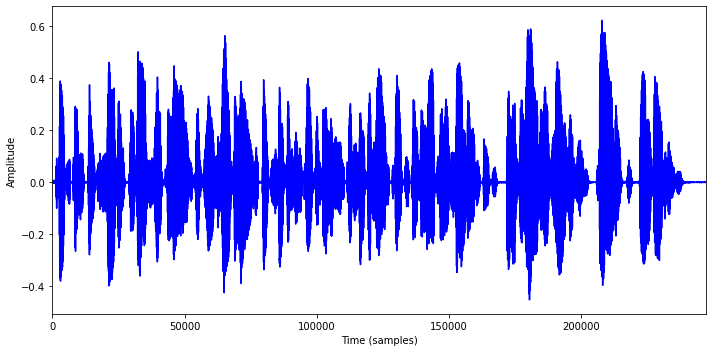
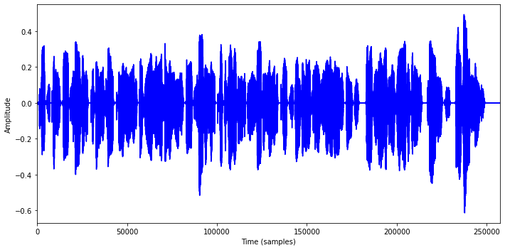

# Watson Text to Speech tutorial

#### Pre-requisites
Ensure that you have Text to Speech (TTS) service installed on your cluster.

### 1. Connect to the Cluster via CLI
1. Log in to your IBM Cloud account.

`ibmcloud login`

2. Select the right account when prompted.

3. Set the correct resource group using the command

`ibmcloud login -g RESOUCE_GROUP`

4. Set the Kubernetes context to your cluster for this terminal session. For more information about this command, [see the docs](https://cloud.ibm.com/docs/containers?topic=containers-cli-plugin-kubernetes-service-cli#cs_cluster_config).

`ibmcloud ks cluster config --cluster CLUSTER_ID`

5. Verify that you can connect to your cluster.

`kubectl config current-context`

6. Create a local proxy to the cluster with kubectl proxy in a separate terminal

`kubectl proxy`

7. Expose the TTS service endpoint using kubectl port forword 

 `kubectl port-forward svc/install-1-tts-runtime 1080`

Now you can use the TTS service into pyhton notebook using http://localhost:1080/

8. Set the NAMESPACE and INSTALL_NAME environment variables.

### 2. Watson Text to Speech Analysis

#### Step 1. Data Loading and Setting up the service
Watson Text to Speech offers so-called parameters for various Text to Speech recognization, audio pre-processing, noise removal, number of speakers in the convesation etc.

1. Import and initialize some helper libs that are used throughout the tutorial.

    ```
    from matplotlib import pyplot as plt
    import IPython.display as ipd
    import librosa
    import pandas as pd
    %matplotlib inline
    import soundfile as sf
    ```

2. Create a custom function to plot amplitude frequency.

    ```
    def print_plot_play(fileName, text=''):
        x, Fs = librosa.load(fileName, sr=None)
        print('%s Fs = %d, x.shape = %s, x.dtype = %s' % (text, Fs, x.shape, x.dtype))
        plt.figure(figsize=(10, 5))
        plt.plot(x, color='blue')
        plt.xlim([0, x.shape[0]])
        plt.xlabel('Time (samples)')
        plt.ylabel('Amplitude')
        plt.tight_layout()
        plt.show()
        ipd.display(ipd.Audio(data=x, rate=Fs))
    ```

3. Setup the parameters for using Text to Speech service

    ```
    headers = {"Content-Type": "application/json","Accept":"audio/wav"}
    params ={'output':'output_text.wav'}
    text_to_speech_url ='http://localhost:1080/text-to-speech/api/v1/synthesize'
    ```

4. Use this example text in the subsequent steps to try out the TTS service.

    ```
    data ='{"text":"Text to Speech service provides APIs that use IBM\'s speech-synthesis capabilities to synthesize text into natural-sounding speech in a variety of languages, dialects, and voices"}'
    ```

5. Create a custom function to get speech from text using the TTS service.

    ```
    def getSpeechFromText(headers,params,data,file_name):
        request =requests.post(text_to_speech_url,headers=headers,params =params,data=data)
        print(request.status_code)
        with open(file_name, mode='bx') as f:
            f.write(request.content)
    ```

6. Send the example text to the TTS service and use the custom function to get the speech output.

    ```
    file_name = 'text_to_speech_sample1.wav'
    result = getSpeechFromText(headers,params,data,file_name)
    print_plot_play(file_name)
    ```



#### Step 2. Modifying speech synthesis characteristics :

Text to Speech service includes query parameters that you can use to globally modify the characteristics of speech synthesis for an entire request:

- rate_percentage
- pitch_percentage

1. Use the `rate_percentage` parameter to adjust the rate percentage and get the output from the TTS service.

```
params ={'voice':'en-US_AllisonV3Voice','rate_percentage':-5}
file_name ="text_to_speeh_rate.wav"
```


2. Use the `pitch_percentage` parameter to adjust the pitch percentage and get the output from the TTS service.

```
params ={'voice':'en-US_AllisonV3Voice','pitch_percentage':-10}
file_name ="text_to_speeh_pitch.wav"
```



#### Conclusion:

This tutorial walks you through the steps of starting a Text to Speech service on the kube cluster, processing the dataset and using the Text to Speech service. This tutorial also shows you how to modify speech synthesis characteristics using different parameters.